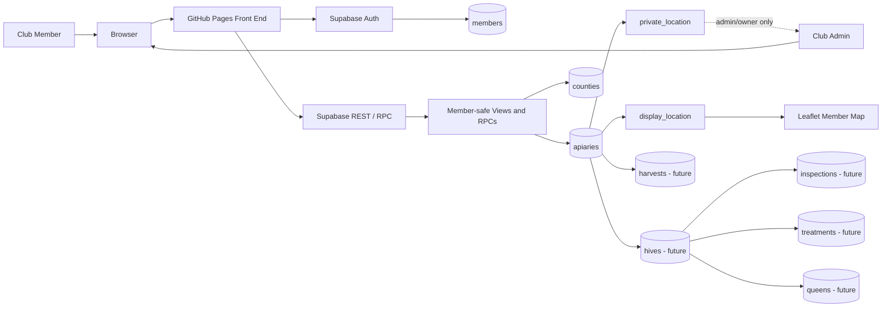

# System Architecture Diagram

## Security boundary

The member map uses only safe views or RPC functions.

The private base table is protected by Row Level Security.

The browser never receives exact apiary coordinates for normal map use.
